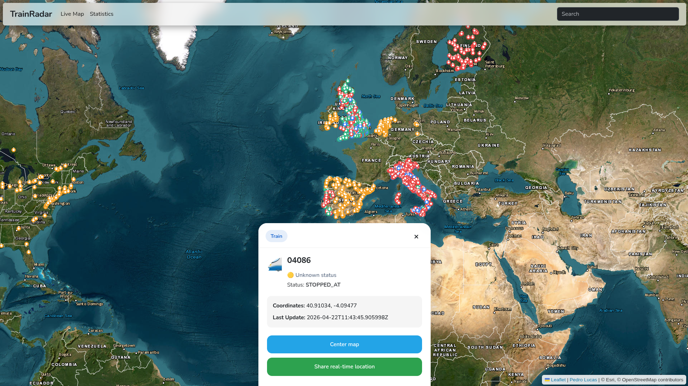

---

# TrainRadar — Live Train Map & Real-Time Train Tracker

**TrainRadar** is a real-time train tracking platform that aggregates publicly available railway data and visualizes live train positions on an interactive map.

It focuses on simplicity, performance, and accessibility — offering a clean interface and developer-friendly integrations.

**Short description:** Multi-country live train tracker with real-time positions and developer-friendly integrations.

---

  

## 🚀 Live Demo

👉 [https://trainradar.vercel.app/](https://trainradar.vercel.app/)

---

## ✨ Key Features

| Feature                       | Benefit                                       |
| ----------------------------- | --------------------------------------------- |
| 🌍 **Multi-country support**  | Unified tracking across multiple countries    |
| ⚡ **Low-latency updates**     | Optimized fetching and caching                |
| 🔗 **Shareable train links**  | Track specific trains via direct URLs         |
| 📡 **Developer-friendly API** | Designed for integrations and experimentation |
| 🗺️ **Railway-aware map**     | Leaflet + OpenRailwayMap overlay              |
| 📱 **Mobile-first design**    | Fully responsive UI                           |
| 🔄 **Data normalization**     | Unified format across multiple providers      |

---

## 📡 API Access

TrainRadar provides a public API designed for personal projects, experimentation, and lightweight integrations.

The API is focused on simplicity and real-time usage for the live map experience.

If you need:

* Access to specific endpoints
* Higher limits
* Custom data formats
* New API capabilities

👉 **Open an issue** describing your use case — API extensions may be considered based on demand and feasibility.

---

### 🔗 Integration & Deep Linking

* `GET /?country=uk&train=8912481`
  Generates a shareable link that opens TrainRadar and focuses the map on a specific train for real-time tracking.

---

> ⚠️ The API is public and free to use, but may be rate-limited to ensure stability and fair access.

---

## 🤝 API Extensions

If you're building something interesting and need additional functionality:

* New endpoints may be considered
* Additional data access may be considered
* New integration ideas are welcome
* Feedback helps shape future API development

👉 Open an issue with your use case — contributions and ideas are encouraged.

---

## ⚠️ Legal & Transparency Notice

**TrainRadar is a personal visualization and aggregation project.**

* It uses **publicly accessible and third-party railway data feeds**
* Some sources may be **unofficial or community-provided**
* **TrainRadar does not own, control, or guarantee any of the data displayed**

All data is provided:

* **“as is” and “as available”**
* **without warranties of any kind**, including accuracy or reliability

**This tool is not intended for operational, safety-critical, or real-world operational decision-making use.**

---

## 📊 Data Responsibility

* Data remains the property of its **respective providers**
* Users must respect **terms of service** of upstream sources
* The author is **not responsible for misuse or downstream usage**

When self-hosting:

> You are solely responsible for complying with all applicable data source policies and laws.

---

## 🔌 API Usage Policy

The public API is intended for:

* Personal use
* Development and testing
* Light integrations

The author reserves the right to:

* Apply rate limiting
* Restrict or block access
* Modify or discontinue the API at any time without notice

---

## 🔧 Self-Hosting

This repository acts as a **documentation and support hub**.

The **core source code is currently private**.

If you need:

* Access to the code
* Help deploying your own instance

👉 Please open an Issue.

---

## 🤝 Support & Issues

Use this repository for:

* Bug reports
* Feature requests
* API questions
* API suggestions / new endpoint requests
* Integration requests

---

## 🙏 Acknowledgments

* OpenRailwayMap for railway visualization tiles
* Leaflet for the mapping library
* Public and community railway data providers

---

## 👤 Author

**Pedro Lucas**

TrainRadar is a personal project exploring real-time train tracking and multi-country transport data visualization.

---

## 📄 License

This repository (documentation and API interface description) is provided under the MIT License.

**The TrainRadar core source code is not included in this repository and is not licensed under MIT.**

**All train data remains the property of its respective providers.**

---

## ⚠️ Disclaimer

TrainRadar is **not affiliated with any railway company or transport authority**.

Use responsibly. 🚂

---
